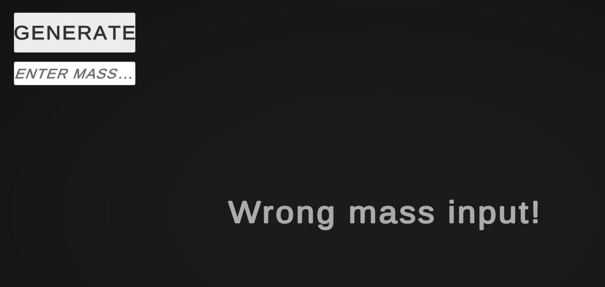
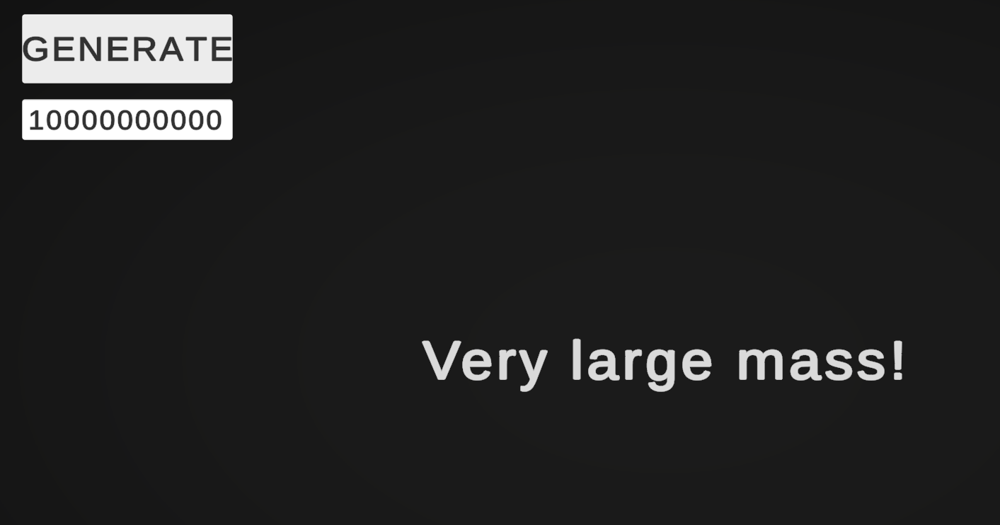
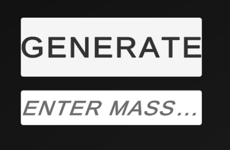
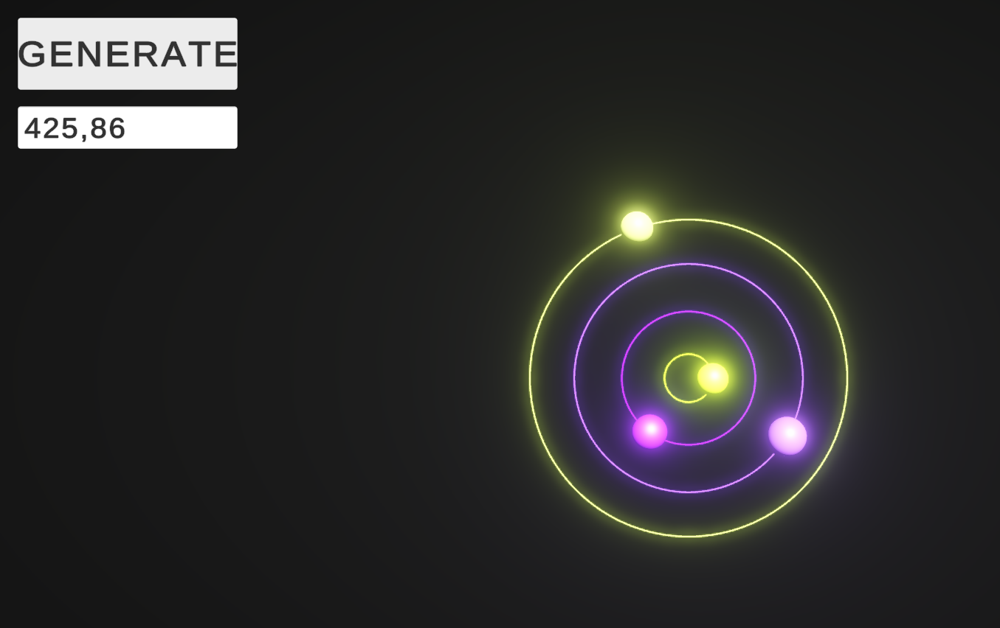
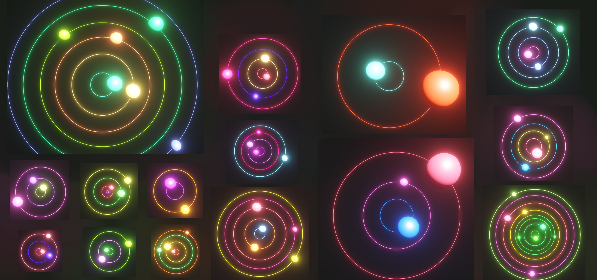

# PlanetarySystemInUnity
## Idea
The main aim was to create **Planetary System**.

There are should me as *minimum 2* **Planeraty Objects**, which should *spin around the center* of **the System**.

## About
To do this task I used all my **OOP skills**.

I created an *Entry field*, where you can *write a mass* of **the System**.

**System's mass** *can't be equals 0* and *large number* (10000000, for example). Also you *can't create* **the System** without *writing a mass*.

## Exceptions
 </img>
 </img>

## Screenshots
 </img>
 </img>
 </img>
